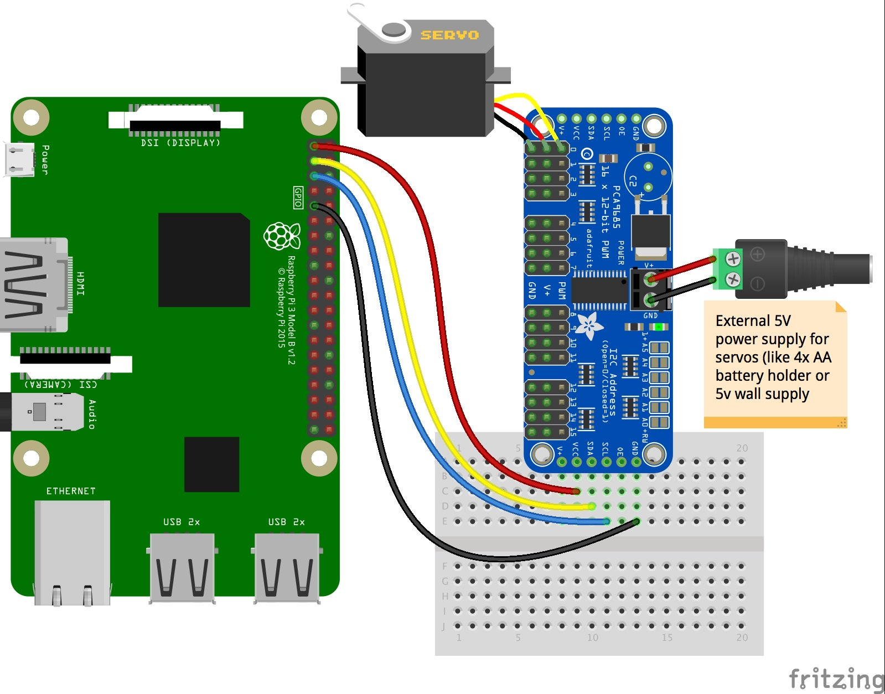

You can skip the breadboard part and connect the I2C direct to the Raspberry PI by referring to the diagram below. Connect as many servo as you need.

Reference :
https://learn.adafruit.com/adafruit-16-channel-servo-driver-with-raspberry-pi/hooking-it-up
