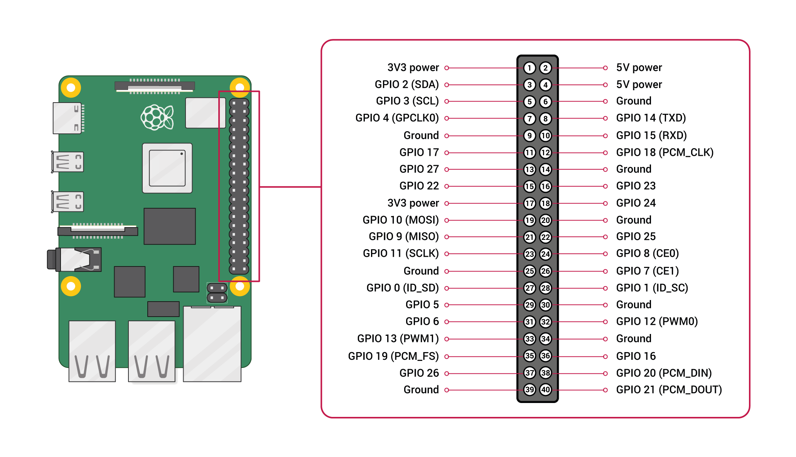

In case you hook up everything and nothing work, in order to confirm which item is having problem, you can use this setup to confirm the servo is working fine.

This setup also suitable for project without the PWM Servo Driver.

The GPIO pins are defined as follows on the Raspberry Pi 4 (most of which are consistent with other Raspberry Pi boards):



Connect first servo to pin 33 (GPIO 13) and second servo to pin 8 (GPIO 14). Second servo can get power from pin 4 and ground at pin 6.


This is the python code to test the servo motor.

```
# Raspberry Pi + MG90S Servo PWM Control Python Code
#
#
import RPi.GPIO as GPIO
import time

# setup the GPIO pin for the servo
servo_pin = 13
GPIO.setmode(GPIO.BCM)
GPIO.setup(servo_pin,GPIO.OUT)
GPIO.setup(14,GPIO.OUT)

# setup PWM process
pwm = GPIO.PWM(servo_pin,50) # 50 Hz (20 ms PWM period)
pwm1 = GPIO.PWM(14,50)

pwm.start(7) # start PWM by rotating to 90 degrees
pwm1.start(7)

for ii in range(0,3):
    pwm.ChangeDutyCycle(2.0) # rotate to 0 degrees
    pwm1.ChangeDutyCycle(2.0)
    time.sleep(0.5)
    pwm.ChangeDutyCycle(12.0) # rotate to 180 degrees
    pwm1.ChangeDutyCycle(12.0)
    time.sleep(0.5)
    pwm.ChangeDutyCycle(7.0) # rotate to 90 degrees
    pwm1.ChangeDutyCycle(7.0)
    time.sleep(0.5)

pwm.ChangeDutyCycle(0) # this prevents jitter
pwm.stop() # stops the pwm on 13
GPIO.cleanup() # good practice when finished using a pin
```

Reference :

https://makersportal.com/blog/2020/3/21/raspberry-pi-servo-panning-camera
